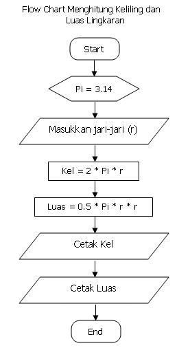

# praktikum3
Abid Luay Raihan Taufik
312210401
MENGHITUNG LUAS DAN KELILING LINGKARAN
Luas     = phi * (r*r)
Keliling = 2 x phi * r
Nilai Phi yang akan kita gunakan adalah 3.14
r merupakan jari-jari lingkaran.

FLOWCHART KELILING DAN LUAS LINGKARAN

PROGRAM DIJALANKAN
.png)

HASIL PROGRAM DIJALANKAN
.png)
